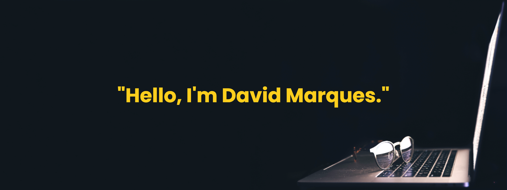

    

  
## 👨🏽‍💻 Olá, Sou David Marques! 👋 **`Desenvolvedor em Desenvolvimento 💻`**
*💬 Com uma ampla trajetória profissional no ramo comercial, estou em transição para me tornar um desenvolvedor fullstack, com conhecimentos em Python, HTML, CSS, JavaScript, Git/GitHub e metodologias ágeis (Kanban, Trello). Destaco-me pela capacidade de analisar oportunidades de melhoria e criar estratégias para solucionar problemas, gerando resultados eficazes e por ser muito criativo. Penso como dono do negócio e não me limito às minhas funções, mas busco constantemente superar expectativas e entregar valor adicional.*
 

## 👨🏽‍💻 "how you doing?" I'm David Marques! 👋 **`Hi, i'm A Developer in Progress 💻`**
*💬 With an extensive professional background in the commercial sector, I am transitioning to become a fullstack developer, with knowledge in Python, HTML, CSS, JavaScript, Git/GitHub and agile methodologies (Kanban, Trello). I stand out for my ability to analyze improvement opportunities and create strategies to solve problems, generating effective results and for being highly creative. I think like a business owner and don't limit myself to my assigned functions, but constantly seek to exceed expectations and deliver additional value.*

---

## 🤖 Linguagens e Tecnologias/ My Tech Stack:

  
  
  
  
  
  
  
  

---

 

## 📊 GitHub Estatísticas/ Stats :

  
  
  

<table>
  <tr>
    <td align="center">
      <b> 🚀 Projetos em Destaque></b>
    </td>
  </tr>
  <tr>
    <td align="center">
      📌 <a href="https://github.com/Davidmax90/Capacita-Brasil-Projeto-Final.ByDMax">Capacita-Brasil-Projeto-Final.ByDMax</a> 
      
    </td>
  </tr>
  
---
</table>

---

### ✍️ Citação aleatória de desenvolvedor/Random Dev Quote :

  
## 🌐 Redes/ Socials:

